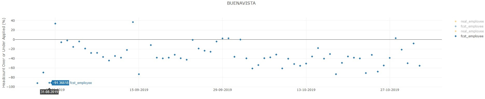
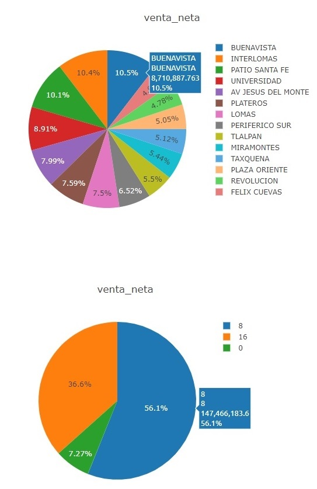

# Final-Project
### Summary
This repository contains a dasboard to depict the actual vs forecast variation of employees in a retail store from August
27 th to November 1 st 2019. 
Statistics regarding units sold, time spent and sales per store or shift are available in pie charts. 
### Technical Details
In order to run the code, it is required: 
* Google Chrome, Firefox or any other Internet Explorer 
* Utilizes Python, JSON, JavaScript, Plotly, HTML and Sklearn 
### Screenshots
Regression.JPG 
  
PlotlyScatterPlotShift8to16.JPG 
  
PlotlyScatterPlotShift8to16Acm.JPG 
  
PlotlyScatterPlotShift8to16Perc.JPG 
  
PlotlyScatterPlotShift8to16PercAcm.JPG 
  
PlotlyPieByStoresByStoresAndShifts 
  
StatisticsSalesByStores 
  
SearchEngineInclusive.JPG 
  
### Explanations 
The outcome is shown in screenshots for reference purpose of the public. 

# Final-Project
Linear Regression model between the number of products and their delivery time. 
The pie charts depict the actual vs forecast variation of employees in a retail store from August
27 th to November 1 st 2019. In the dashboard, interactive scatter plots illustrate cumulative
amounts, historical capability in percentages, and total sales per branch or shift in multiple periods
of time. Tools: Python, JSON, JavaScript, Plotly, HTML.
